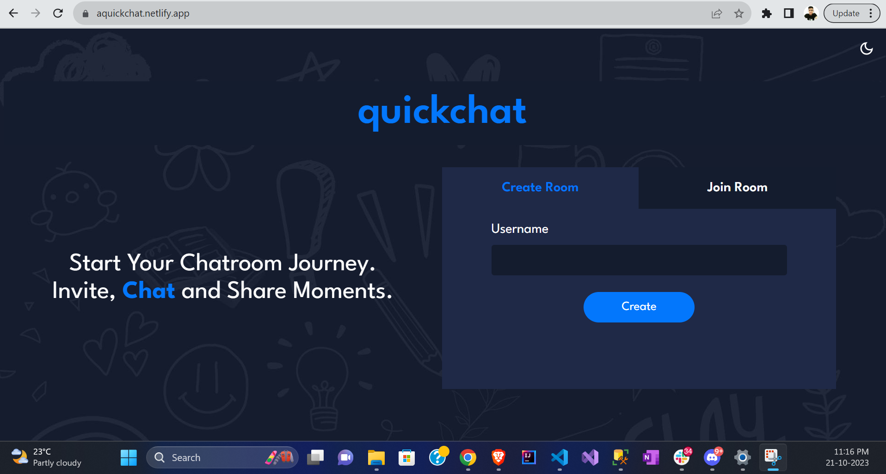
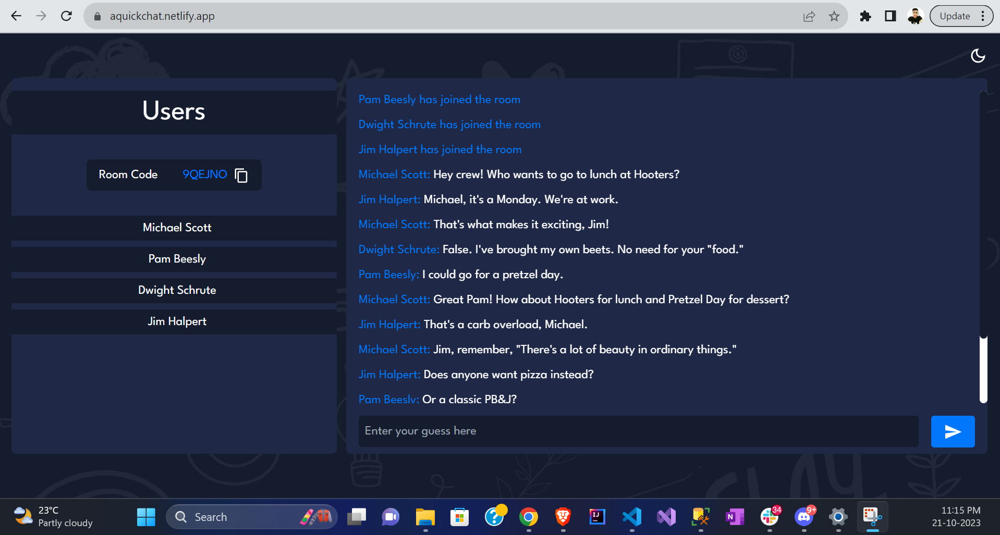

# QuickChat Web App

Welcome to our web-based platform that empowers users to effortlessly create private chatrooms and extend invitations to others, all without the requirement for user registration or login. Join the conversation seamlessly and securely, and experience the freedom of instant communication.

## Server Repo and Live Site URL

This repository holds the frontend code only. For the server side code, visit [here](https://github.com/sthitaprajna-mishra/quickchatserver).

[Click here](https://aquickchat.netlify.app) to visit the live site deployed on Netlify.

## Table of contents

- [Overview](#overview)
  - [Description](#description)
  - [Screenshot](#screenshot)
- [My process](#my-process)
  - [Built with](#built-with)
  - [Insights](#insights)
  - [Scope for Improvement](#scope-for-improvement)
- [Author](#author)
- [Acknowledgments](#acknowledgments)

## Overview

### Description

Users will be able to -

- Create private chatroom(s)
- Invite multiple users to join the chatroom and exchange text messages
- Get notified whenever someone drops or joins the chatroom
- Join multiple rooms at the same time
- Perform all the above operations without signing up/logging in
- View the optimal layout for the interface depending on their device's screen size

### Screenshots -

Below are some screenshots captured while using the live-deployed app.
As a bonus treat for "The Office" fans, there is a delightful reimagination of how beloved characters from the show would have interacted within this virtual chatroom.

#### Landing Page

#### Chatroom

## My process

### Built with

- React
- Vite
- Canva
- TailwindCSS
- Material UI
- SocketIO
- Node
- Express

### Insights

- I initially considered incorporating Material UI for a majority of the app's components. However, during the development process, I opted to utilize TailwindCSS for the core design, reserving Material UI exclusively for the purpose of integrating icons. This decision provided me with a greater degree of creative liberty, enabling me to craft and style components that align more closely with my individual preferences and the overarching design concept of the website.

- In this project, while the primary focus was on the frontend, I delved into the world of backend development to handle real-time messages using Socket.io. Despite the project's frontend-centric nature, I dedicated a significant amount of time to research and implement the backend logic.

- I opted to utilize Canva for the creation of the background images, a step that may not have been technically imperative but was driven by my desire to align the aesthetics with the vivid vision I had in mind. The use of Canva allowed me to meticulously craft the visual appeal of the platform, ensuring that it harmoniously matched the artistic concept I envisioned.

### Scope for Improvement

- Add an ability to incorporate emoticons and GIFs in conversations. This will infuse life and expressiveness into every exchange, making interactions more engaging and entertaining.

- At present, this app doesn't utilize a traditional database to store conversations. This aligns with the core concept of the application, which prioritizes short and spontaneous interactions over comprehensive, long-term chat histories. However, to effectively manage scalability and accommodate increasing demand, it is possible to explore some real-time data storage solutions that can enhance the app's performance while still preserving its unique focus on quick and dynamic conversations.

## Author

- Frontend Mentor - [@sthitaprajna-mishra](https://www.frontendmentor.io/profile/sthitaprajna-mishra)
- LinkedIn - [@sthitaprajna-mishra](https://www.linkedin.com/in/sthitaprajna-mishra-b63940153/)
